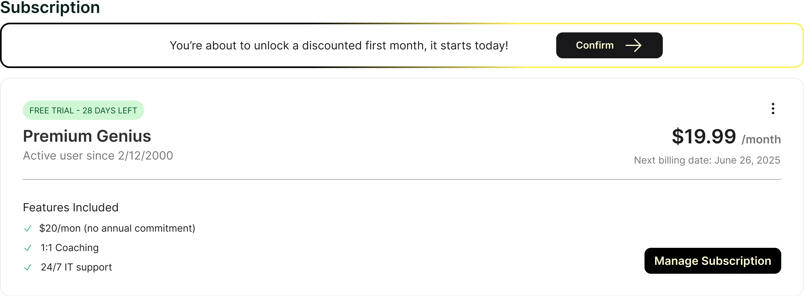

The SubscriptionHub is the quickest way to get started with SubscriptionManagement. The SubscriptionHub will render a subscription management widget to the container and manage the entire subscription management and retention workflow.

## Implementation

### TypeScript/JavaScript

You can embed the Subscription Hub directly into your application:

```typescript
renumerate.mountSubscriptionHub("elementId", "sessionId", "classes");
```

##### mountSubscriptionHub Arguments

| key       | type                | notes                                    |
| --------- | ------------------- | ---------------------------------------- |
| elementId | string              | The id for the container element         |
| sessionId | string              | Your customer's subscription session id  |
| wrapperClasses | string \| undefined | Wrapper element classes (optional)  |
| iframeClasses | string \| undefined | Iframe element classes (optional)    |
| callbacks | object \| undefined | Event callbacks (optional)               |

#### Adding Callbacks

You can add callback functions to respond to subscription management events:

##### Callbacks
| key          | type         | notes                                                 |
| ------------ | ------------ | ------------------------------------------------------|
| onComplete   | () => void   | Called when the retention flow is finished (optional) |
| onRetained   | () => void   | Called when the customer is retained       (optional) |
| onCancelled  | () => void   | Called when the customer cancels           (optional) |


```typescript
renumerate.mountSubscriptionHub(
  "elementId", 
  "sessionId", 
  "hub-wrapper",
  "hub-iframe",
  {
    onComplete: () => {
      // Called when any action is completed
      console.log("Subscription action completed");
    },
    onRetained: () => {
      // Called when customer accepts a retention offer during cancellation
      console.log("Customer was retained!");
    },
    onCancelled: () => {
      // Called when customer completes cancellation
      console.log("Customer cancelled subscription");
    }
  }
);
```

### React
For React applications, use the SubscriptionHub component for seamless integration:

Basic Setup
All Renumerate React components must be wrapped in a RenumerateProvider:

```tsx
import React from 'react';
import { RenumerateProvider, SubscriptionHub } from '@renumerate/js/react';

function App() {
  const sessionId = "sub_example123";

  return (
    <RenumerateProvider config={{
      publicKey: 'your-public-key',
      fallbackEmail: 'support@yourcompany.com'
    }}>
      {/* Default SubscriptionHub */}
      <SubscriptionHub sessionId={sessionId} />
      
      {/* Styled SubscriptionHub with callbacks */}
      <SubscriptionHub 
        sessionId={sessionId}
        wrapperClassName="custom-hub-wrapper h-96 w-full border rounded-lg"
        iframeClassName="w-full h-full rounded-lg"
        callbacks={{
          onComplete: () => {
            console.log("Action completed in subscription hub");
          },
          onRetained: () => {
            alert("Great! Your subscription has been saved.");
          },
          onCancelled: () => {
            window.location.href = "/goodbye";
          }
        }}
      />
    </RenumerateProvider>
  );
}
```
### Generating a SubscriptionHub session id

Subscription sessions allow you to present the SubscriptionHub widget to your customers to easily manage and view their subscriptions.

*Subscription sessions begin with `sub_`*

To generate a customer's session ID, make a POST request to `https://api.renumerate.com/v1/subscription/session` from your application's backend.

Ensure the following:

1. Include the `X-Brand-Key` header with your Brand's private key for authentication. See the [Where To Find Private Key](../how-to/#how-to-find-your-brand-private-key-x-brand-key) section.
2. Pass the customer's ID or email in the request body as specified below.

This process securely creates a session ID that grants the customer access to their subscription management portal.

**Request Body Parameters:**

When generating a SubscriptionHub session, you must include either the `customer_id` or `customer_email` (or both). Below is a table of all available parameters:

| key                          | type                | notes                                   |                                      |
| ---------------------------- | ------------------- | --------------------------------------- | ------------------------------------ |
| subscription                 | object              |                                         |                                      |
| subscription.customer_id     | string \| undefined | Your stripe customerId                  |                                      |
| subscription.customer_email  | string \| undefined | The customer's email address in stripe  |
| subscription.subscription_id | string \| undefined | The specific subscription id (optional) |                                      |

### Backend Example
Node.js/TypeScript

```typescript
const privateKey = process.env.RENUMERATE_PRIVATE_KEY;

const requestBody = {
  subscription: {
    customer_id: "cus_NffrFeUfNV2Hib", // Example stripe id
    subscription_id: "sub_1MowQVLkdIwHu7ixeRlqHVzs", // Your specific subscription
  },
};

const response = await fetch("https://api.renumerate.com/v1/subscription/session", {
  method: "POST",
  headers: {
    "Content-Type": "application/json",
    "X-Brand-Key": privateKey,
  },
  body: JSON.stringify(requestBody),
});

const {
  session: { id },
} = await response.json();
```
